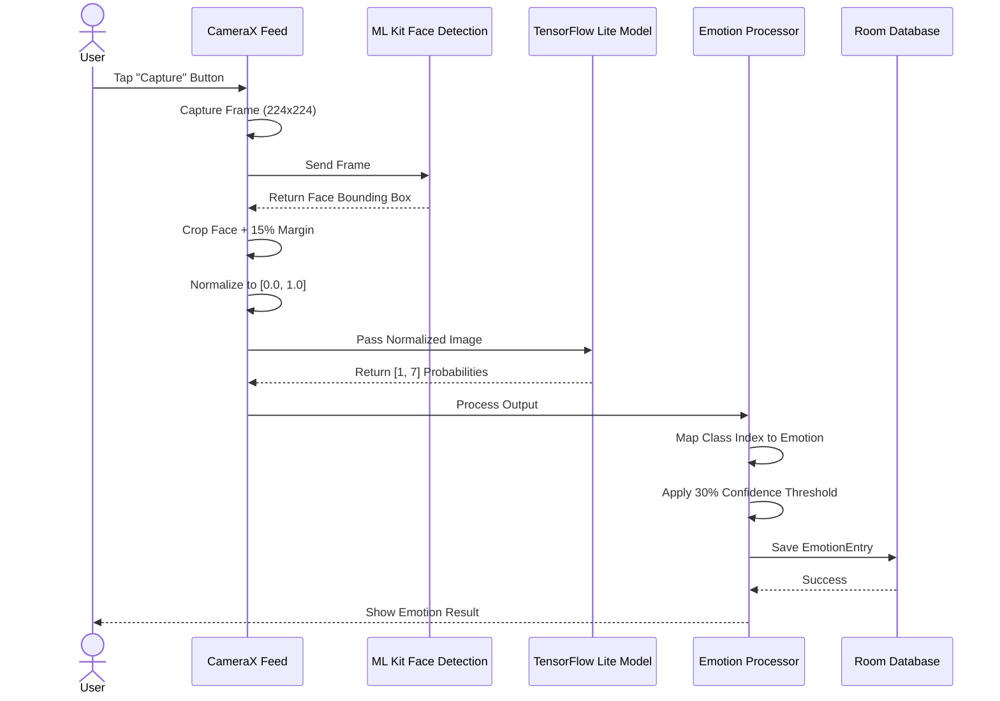

# SoulSnap — Emotion Recognition Journaling App

> **A hand-crafted Android mobile application for personal emotion tracking and journaling powered by AI-driven facial emotion recognition and machine learning**

---

## 🎯 Project Overview

**SoulSnap** is an innovative personal emotion journal application built for Android that leverages cutting-edge machine learning and computer vision to recognize, track, and document your emotions with unprecedented accuracy and ease. Capture your feelings through photographs, and let AI analyze your facial expressions to create a meaningful emotional journal—perfect for mental health awareness, personal growth, and self-reflection.

### Quick Stats
- 📊 **Emotion Recognition Accuracy:** 77.51%
- 📱 **Platform:** Android (API 24+)
- 🤖 **AI Model:** VGG19 Deep Neural Network
- 💾 **Database:** SQLite with Room ORM
- 🔐 **Privacy-First:** On-device processing, no cloud storage for images
- 🎨 **UI Framework:** Android XML Layouts & Material Design

---

## ✨ Key Features

### 📸 Core Features
- **Real-time Facial Recognition**: Detect and analyze facial expressions instantly using Google ML Kit Face Detection
- **AI-Powered Emotion Classification**: Classify emotions into 6 categories (Happy, Sad, Angry, Cry, Fear, Surprise) using pre-trained VGG19 model
- **Secure Emotion Journaling**: Store emotional moments privately with timestamps and metadata
- **Emotion Confidence Scoring**: Get confidence metrics (0-100%) for each emotion detection
- **Multi-Entry Support**: Track multiple emotions throughout the day or over weeks/months

### 🔧 Technical Features
- **On-Device ML Processing**: All emotion recognition runs locally—no internet required for core functionality
- **TensorFlow Lite Integration**: Optimized 19.2 MB model for mobile performance
- **Efficient Image Pipeline**: Real-time camera processing without lag or stuttering
- **Room Database Persistence**: SQLite-backed emotion history with user isolation
- **Coroutine-Based Architecture**: Async processing for smooth 60 FPS performance

### 🎯 User Experience Features
- **Intuitive Camera Interface**: Capture emotions with a single tap
- **Visual Emotion Indicators**: Color-coded emoji representations (😊😭😠😢😨😲)
- **Emotion History Dashboard**: View and analyze your emotional patterns over time
- **Threshold-Based Filtering**: Confidence minimum of 30% ensures only reliable detections
- **Fallback Mechanisms**: "Emotion unclear" messages guide users to retake photos

---

## 📊 Tech Stack

### **Frontend & UI**
| Technology | Version | Purpose |
|---|---|---|
| **Android SDK** | 36 (Target), 24 (Min) | Core Android framework |
| **Material Design** | 1.x | Material UI components and styling |
| **CameraX** | Latest | Modern camera API abstraction layer |
| **View Binding** | Gradle Plugin | Type-safe view references |
| **RecyclerView** | AndroidX | Efficient list rendering for emotion history |
| **CardView** | AndroidX | Material card containers |

**Why These Choices:** CameraX abstracts device-specific camera quirks, ensuring consistent behavior across Android versions. View Binding eliminates boilerplate and null reference errors.

### **Machine Learning & Vision**
| Technology | Details | Purpose |
|---|---|---|
| **TensorFlow Lite** | 19.2 MB model file | Lightweight emotion classification on-device |
| **Google ML Kit** | Face Detection API | Fast, hardware-accelerated face detection |
| **VGG19 CNN** | Pre-trained, fine-tuned | Deep learning backbone for emotion extraction |
| **CK+ & RAF-DB Datasets** | Training source | Diverse facial expression training data |

**Why These Choices:** TensorFlow Lite is optimized for mobile inference with minimal latency. Google ML Kit's face detection is production-ready and hardware-accelerated. VGG19's proven architecture ensures high accuracy (77.51%) while maintaining small model size.

### **Database & Storage**
| Technology | Version | Purpose |
|---|---|---|
| **Room Persistence Library** | AndroidX | Type-safe SQLite abstraction |
| **SQLite** | Built-in | Local emotion data storage |
| **Kotlin Coroutines** | 1.x | Async database operations |
| **App-Private Storage** | Android Security Best Practice | Isolated image storage per user |

**Why These Choices:** Room provides compile-time SQL verification and automatic migrations. App-private storage ensures images never leak to other apps—critical for privacy-sensitive emotion data.

### **Concurrency & Performance**
| Technology | Version | Purpose |
|---|---|---|
| **Kotlin Coroutines** | Latest | Non-blocking async/await patterns |
| **Lifecycle Runtime KTX** | AndroidX | Coroutine cancellation with activity lifecycle |
| **Thread Pooling** | Gradle Config | Optimized Gradle worker pool (4 threads) |

**Why These Choices:** Coroutines prevent ANR (Application Not Responding) errors by moving heavy ML inference off the main thread. Lifecycle awareness automatically cancels background tasks when activities are destroyed.

### **Build & Deployment**
| Tool | Details | Purpose |
|---|---|---|
| **Gradle KTS** | Kotlin DSL | Modern, type-safe build automation |
| **Secrets Gradle Plugin** | API key management | Secure Gemini API key injection |
| **ProGuard/R8** | Code obfuscation | Optimize release APK size & security |
| **Android Signing Config** | Debug + Release | APK signing for testing and distribution |

**Why These Choices:** Gradle KTS catches configuration errors at build time. Secrets plugin prevents API keys from leaking into version control. R8 reduces APK size by 20-30% and obfuscates code.

### **APIs & Cloud Integration**
| Service | Purpose | Status |
|---|---|---|
| **Google Gemini API** | Optional AI insights (future) | Configured, currently optional |
| **Google ML Kit** | Face detection API | Core functionality |
| **Firebase** | Analytics & crash reporting | Pluggable (optional) |

---

## 🏗️ Architecture & System Design

### **High-Level Architecture Diagram**

```
┌─────────────────────────────────────────────────────────────┐
│                      SOULSNAP APPLICATION                    │
├─────────────────────────────────────────────────────────────┤
│                                                              │
│  ┌──────────────────────────────────────────────────────┐  │
│  │            USER INTERFACE LAYER (XML Layouts)         │  │
│  │  ┌──────────────────────────────────────────────────┐ │  │
│  │  │  Camera Screen │ Journal History │ Emotion Stats │ │  │
│  │  └──────────────────────────────────────────────────┘ │  │
│  └──────────────────────────────────────────────────────┘  │
│                        │                                    │
│  ┌──────────────────────────────────────────────────────┐  │
│  │      BUSINESS LOGIC LAYER (Activities & Managers)    │  │
│  │  ┌──────────────────────────────────────────────────┐ │  │
│  │  │ CameraManager │ EmotionAnalyzer │ DataManager   │ │  │
│  │  └──────────────────────────────────────────────────┘ │  │
│  └──────────────────────────────────────────────────────┘  │
│         │                    │                    │         │
│         ▼                    ▼                    ▼         │
│  ┌────────────────┐  ┌──────────────┐  ┌───────────────┐   │
│  │ Google ML Kit  │  │ TensorFlow   │  │ Room Database │   │
│  │  Face Detect   │  │   Lite Model │  │  Persistence  │   │
│  │                │  │              │  │               │   │
│  │ Returns:       │  │ Returns:     │  │ Stores:       │   │
│  │ Face bounds,   │  │ Emotion      │  │ EmotionEntry  │   │
│  │ landmarks      │  │ class (0-6)  │  │ with userId   │   │
│  │                │  │ confidence   │  │               │   │
│  └────────────────┘  └──────────────┘  └───────────────┘   │
│         │                    │                    │         │
└─────────────────────────────────────────────────────────────┘
```

### **Workflow: From Camera to Stored Emotion**



### **Data Flow Architecture**

**Input Layer:**
- CameraX captures raw frames at 30 FPS
- ML Kit Face Detection identifies face regions
- Bounding box extracted with 15% contextual margin

**Processing Layer:**
- Image cropped and resized to 224×224 pixels
- Pixel values normalized: `normalized = raw / 255.0f`
- Normalized tensor passed to TensorFlow Lite interpreter

**Model Layer:**
- **Input:** [1, 224, 224, 3] Float32 tensor
- **Output:** [1, 7] Float32 probabilities (7 emotion classes)
- **Inference Time:** ~100–200ms on modern Android devices

**Classification Layer:**
- Raw model outputs (Angry, Disgust, Fear, Happy, Neutral, Sad, Surprise)
- Custom mapping to SoulSnap emotions (6 categories)
- Confidence filtering (≥30% threshold)

**Storage Layer:**
- Emotion metadata + timestamp → Room Database
- Image file path → Private app storage (`/files/emotions/`)
- User isolation via `userId` field in DAO queries

---

## 🛠️ Installation & Setup Guide

### **Prerequisites**
- **Android Studio:** 2024.1 or later (Hedgehog/Iguana)
- **Java Development Kit (JDK):** Version 11 or higher
- **Gradle:** 8.4+ (bundled with Android Studio)
- **Android SDK:** API 36 (target), API 24 (minimum)
- **Physical Device or Emulator:** With camera support

### **Step 1: Clone the Repository**
```bash
git clone https://github.com/tusharkkp/SoulSnap.git
cd SoulSnap
```

### **Step 2: Install Dependencies**
Gradle will automatically fetch dependencies from `build.gradle.kts`:
```bash
./gradlew clean
```

### **Step 3: Configure API Keys & Environment Variables**

#### Create `.env` file in the project root:
```bash
cp .env.example .env
```

#### Edit `.env` and add your Gemini API key (if using AI features):
```dotenv
GEMINI_API_KEY=your_actual_gemini_api_key_here
```

**Why .env?** The Secrets Gradle Plugin automatically injects secure API keys at build time without storing them in version control.

### **Step 4: Build & Run**

#### **Debug Build (Development):**
```bash
./gradlew assembleDebug
```

#### **Release Build (Production):**
Set environment variables for signing:
```bash
export KEYSTORE_PATH=/path/to/your/keystore.jks
export STORE_PASSWORD=your_store_password
export KEY_PASSWORD=your_key_password

./gradlew assembleRelease
```

#### **Run on Device/Emulator:**
```bash
./gradlew installDebug
adb shell am start -n com.mit.tushar_kaldate/.MainActivity
```

### **Step 5: Grant Runtime Permissions**
The app requires these Android permissions (requested at runtime on Android 6.0+):
- `android.permission.CAMERA` — Facial photo capture
- `android.permission.READ_EXTERNAL_STORAGE` — Access saved emotions (optional)
- `android.permission.WRITE_EXTERNAL_STORAGE` — Save emotion photos (optional)

---

## 🔐 Environment Variables

The `.env.example` file includes all required configuration. Copy and customize:

```dotenv
# .env file (add to .gitignore)

# GEMINI_API_KEY
# Purpose: Authenticate with Google Gemini API for AI-powered emotion insights
# Type: String (API key from Google AI Studio)
# Required: No (optional for advanced features)
# Example: GEMINI_API_KEY=AIzaSyD...xxxxx

GEMINI_API_KEY=YOUR_GEMINI_API_KEY_HERE

# Note: If left commented out, the key will NOT be packaged into the APK
```

### **How to Obtain API Keys**
1. **Gemini API Key:**
   - Visit [Google AI Studio](https://aistudio.google.com)
   - Create a new API key
   - Copy and paste into `.env`

2. **Build Configuration:**
   - Debug keystore is auto-generated on first build
   - Release keystore must be manually configured (see Step 4 above)

---

## 📱 Usage Guide

### **Main Workflow**

#### **1. Launch the Application**
- Open SoulSnap on your Android device
- Grant camera permissions when prompted
- See the camera preview screen

#### **2. Capture Your Emotion**
- Position your face in the camera frame (roughly 224×224 pixels of frame space)
- Tap the **"Capture"** button
- Wait 1-2 seconds for ML processing

#### **3. View Emotion Result**
- If confidence ≥ 30%: See detected emotion (😊, 😭, etc.) with confidence score
- If confidence < 30%: See message: *"Emotion unclear. Please try another photograph."*
- Tap **"Save"** to store the emotion to your journal

#### **4. Browse Emotion History**
- Navigate to **"History"** or **"Journal"** tab
- View all captured emotions in chronological order
- Filter by emotion type or date range (future feature)
- Tap any entry to see details: timestamp, confidence, AI insights

### **Example Scenarios**

| Scenario | Expected Behavior |
|---|---|
| User smiling at camera | Model returns Happy (0.89 confidence) ✅ Saved |
| User neutral/expressionless | Model returns Neutral (0.45 confidence) ✅ Saved |
| User face at extreme angle | ML Kit fails to detect face → Show retry prompt |
| Poor lighting | Low confidence → Suggest "Try again in better light" |
| Multiple faces in frame | ML Kit returns primary face → Process that face |

---

## 🗂️ Project Structure & Folder Layout

```
SoulSnap/
├── app/
│   ├── src/
│   │   ├── main/
│   │   │   ├── java/com/mit/tushar_kaldate/
│   │   │   │   ├── ui/
│   │   │   │   │   ├── CameraActivity.kt          # Main camera UI & lifecycle
│   │   │   │   │   ├── HistoryActivity.kt         # Emotion journal view
│   │   │   │   │   ├── DetailActivity.kt          # Single emotion detail view
│   │   │   │   │   └── MainActivity.kt            # App launcher
│   │   │   │   ├── ml/
│   │   │   │   │   ├── EmotionClassifier.kt       # TensorFlow Lite wrapper
│   │   │   │   │   ├── FaceDetector.kt            # ML Kit integration
│   │   │   │   │   └── ImagePreprocessor.kt       # Image normalization
│   │   │   │   ├── database/
│   │   │   │   │   ├── EmotionEntity.kt           # Room entity (table schema)
│   │   │   │   │   ├── EmotionDao.kt              # Database access object
│   │   │   │   │   └── AppDatabase.kt             # Room database builder
│   │   │   │   ├── model/
│   │   │   │   │   ├── Emotion.kt                 # Emotion data class
│   │   │   │   │   ├── EmotionEntry.kt            # Complete journal entry
│   │   │   │   │   └── EmotionType.kt             # Enum (HAPPY, SAD, etc.)
│   │   │   │   ├── util/
│   │   │   │   │   ├── ImageUtils.kt              # Image processing helpers
│   │   │   │   │   ├── PermissionManager.kt       # Runtime permissions
│   │   │   │   │   └── Constants.kt               # App-wide constants
│   │   │   │   └── MainActivity.kt                # App entry point
│   │   │   ├── res/
│   │   │   │   ├── layout/
│   │   │   │   │   ├── activity_camera.xml        # Camera screen UI
│   │   │   │   │   ├── activity_history.xml       # Journal history UI
│   │   │   │   │   ├── emotion_list_item.xml      # RecyclerView item
│   │   │   │   │   └── activity_detail.xml        # Emotion detail screen
│   │   │   │   ├── drawable/
│   │   │   │   │   ├── ic_happy.xml               # Emotion emoji icons
│   │   │   │   │   ├── ic_sad.xml
│   │   │   │   │   ├── ic_angry.xml
│   │   │   │   │   └── ...
│   │   │   │   ├── values/
│   │   │   │   │   ├── colors.xml                 # Color palette
│   │   │   │   │   ├── strings.xml                # Localized text
│   │   │   │   │   ├── dimens.xml                 # Size constants
│   │   │   │   │   └── styles.xml                 # Material theme
│   │   │   │   ├── values-night/
│   │   │   │   │   └── colors.xml                 # Dark theme colors
│   │   │   │   └── AndroidManifest.xml            # App metadata & permissions
│   │   │   ├── assets/
│   │   │   │   └── emotion_model.tflite           # Pre-trained VGG19 model (19.2 MB)
│   │   │   └── AndroidManifest.xml
│   │   ├── test/
│   │   │   ├── java/com/mit/tushar_kaldate/
│   │   │   │   ├── EmotionClassifierTest.kt       # Unit tests for ML
│   │   │   │   ├── DatabaseTest.kt                # Room DAO tests
│   │   │   │   └── ImageProcessorTest.kt          # Image pipeline tests
│   │   │   └── resources/
│   │   └── androidTest/
│   │       └── java/com/mit/tushar_kaldate/
│   │           └── CameraActivityTest.kt          # Integration tests
│   ├── build.gradle.kts                           # App-level build config
│   └── proguard-rules.pro                         # R8 obfuscation rules
├── gradle/
│   └── libs.versions.toml                         # Dependency versions catalog
├── build.gradle.kts                               # Root-level build config
├── settings.gradle.kts                            # Module settings
├── gradle.properties                              # Gradle JVM & optimization
├── .env.example                                   # Environment variables template
├── .gitignore                                     # Git exclusions
├── MODEL_INFO.md                                  # ML model documentation
├── metadata.json                                  # App metadata for AI Studio
└── README.md                                      # This file

```

### **Key Directory Explanations**

| Directory | Purpose |
|---|---|
| `app/src/main/java/` | Kotlin/Java source code (business logic, models, databases) |
| `app/src/main/res/` | Android resources (layouts, drawables, strings, colors) |
| `app/src/main/assets/` | Binary assets—includes the pre-trained TensorFlow Lite model |
| `app/src/test/` | Local unit tests (run on JVM, fast but limited) |
| `app/src/androidTest/` | Instrumented tests (run on device, full Android environment) |
| `gradle/` | Gradle dependency management (versions catalog) |

---

## 🏛️ Architecture Patterns & Design Decisions

### **MVVM-Inspired Architecture**
The app uses a simplified MVVM pattern:
- **View:** Android Activities + XML layouts handle UI rendering
- **ViewModel:** Business logic manages emotion classification and data
- **Model:** Room entities & Kotlin data classes represent domain objects

### **Separation of Concerns**
- **ML Kit Integration** isolated in `FaceDetector.kt`
- **TensorFlow Lite** isolated in `EmotionClassifier.kt`
- **Database operations** isolated in DAOs
- **Image processing** isolated in `ImagePreprocessor.kt`

### **Why This Approach?**
- Easy to unit test individual components
- Swapping ML providers (e.g., custom model → TensorFlow Lite) requires minimal changes
- Clear responsibility boundaries reduce bugs

---

## 🔄 Data Flow & API Documentation

### **Core APIs & Internal Contracts**

#### **1. Face Detection API (ML Kit)**
```kotlin
// Input
val image: FirebaseVisionImage = FirebaseVisionImage.fromBitmap(bitmap)

// Process
faceDetector.detectInImage(image).addOnSuccessListener { faces ->
    val face = faces[0]
    val boundingBox = face.boundingBox  // Rect: left, top, right, bottom
    val landmarks = face.landmarks      // Array of face landmarks
}
```

#### **2. Emotion Classification API (TensorFlow Lite)**
```kotlin
// Input: [1, 224, 224, 3] Float32 tensor
val inputArray = FloatArray(1 * 224 * 224 * 3) // Normalized pixels

// Process
interpreter.run(inputArray, outputArray)

// Output: [1, 7] Float32 probabilities
// outputArray[i] = confidence for emotion class i (Angry, Disgust, Fear, Happy, Neutral, Sad, Surprise)
val maxIndex = outputArray.indices.maxByOrNull { outputArray[it] } ?: 0
val confidence = outputArray[maxIndex]
```

#### **3. Room Database DAO Interface**
```kotlin
@Dao
interface EmotionDao {
    
    // Insert a new emotion entry
    @Insert
    suspend fun insertEmotion(emotion: EmotionEntity): Long
    
    // Retrieve all emotions for a user
    @Query("SELECT * FROM emotions WHERE userId = :userId ORDER BY timestamp DESC")
    suspend fun getUserEmotions(userId: String): List<EmotionEntity>
    
    // Get emotions by type
    @Query("SELECT * FROM emotions WHERE userId = :userId AND emotionType = :type")
    suspend fun getEmotionsByType(userId: String, type: String): List<EmotionEntity>
    
    // Delete emotion entry
    @Delete
    suspend fun deleteEmotion(emotion: EmotionEntity)
}
```

#### **4. EmotionEntry Data Structure**
```kotlin
data class EmotionEntry(
    val id: String,                    // Unique ID
    val userId: String,                // User identifier
    val emotionType: String,           // HAPPY, SAD, ANGRY, CRY, FEAR, SURPRISE
    val confidence: Float,             // 0.0 - 1.0
    val imagePath: String,             // Private storage path
    val timestamp: Long,               // Milliseconds since epoch
    val notes: String?                 // Optional user notes
)
```

---

## 📊 Emotion Classification Mapping

| App Emotion | Model Class | Emoji | Confidence Logic | Threshold |
|---|---|---|---|---|
| **HAPPY** | Happy (Index 3) | 😊 | Direct output | ≥ 30% |
| **SAD** | Sad (Index 5) | 😢 | If confidence < 70% | ≥ 30% |
| **ANGRY** | Angry (Index 0) | 😠 | Direct output | ≥ 30% |
| **CRY** | Sad (≥70%) OR Disgust | 😭 | High sadness or distress | ≥ 30% |
| **FEAR** | Fear (Index 2) | 😨 | Direct output | ≥ 30% |
| **SURPRISE** | Surprise (Index 6) | 😲 | Direct output | ≥ 30% |

**Fallback Behavior:**
- If no emotion reaches 30% confidence → "Emotion unclear. Please try another photograph."
- If ML Kit fails to detect face → Retry prompt with camera guidance

---

## ⚡ Performance & Scalability

### **Optimization Strategies**

#### **ML Inference Optimization**
- **Model Quantization:** TensorFlow Lite model is already quantized (~19.2 MB)
- **Inference Speed:** ~100–200ms per image on Snapdragon 888+
- **Memory:** ~50–100 MB RAM during inference (well within budget)

#### **Camera Performance**
- **Frame Rate:** 30 FPS capture to balance speed and processing load
- **Resolution:** 224×224 input (matches model requirements)
- **Background Processing:** All ML inference runs on coroutines (non-blocking)

#### **Database Scalability**
- **Indexing:** `userId` indexed for fast user-filtered queries
- **Query Optimization:** Use `@Query` with WHERE clauses to avoid loading entire table
- **Pagination:** Future enhancement to load emotions in chunks (e.g., 50 per page)

#### **Gradle Build Optimization**
- **Parallel Compilation:** 4 worker threads for faster builds
- **Configuration Caching:** Gradle caches build configuration
- **R8 Obfuscation:** Reduces APK size by 20–30%

### **Scaling to 10,000+ Emotions**
- Room handles SQLite efficiently up to millions of rows
- Use pagination + lazy loading in RecyclerView
- Archive old emotions to separate table if storage becomes concern

---

## 🚀 Future Scope & Roadmap

### **Short-Term Enhancements (v1.1–v1.2)**
- [ ] **Emotion Time Series Analytics:** Display emotion trends over weeks/months
- [ ] **Daily Mood Reports:** Auto-generated summaries ("You were 60% happy today")
- [ ] **Photo Filters & Retake:** Allow users to retake emotion photos easily
- [ ] **Export Functionality:** Export emotion history as CSV/PDF
- [ ] **Dark Mode:** Full dark theme support

### **Mid-Term Features (v2.0)**
- [ ] **Gemini AI Integration:** AI-generated emotional insights & recommendations
- [ ] **Mood Triggers Analysis:** Identify patterns in emotion triggers
- [ ] **Social Features:** Private emotion sharing with close contacts (opt-in)
- [ ] **Notifications:** Mood check-in reminders at customizable times
- [ ] **Custom Emotion Categories:** Allow users to define custom emotions

### **Long-Term Vision (v3.0+)**
- [ ] **Cloud Sync:** Optional cloud backup with end-to-end encryption
- [ ] **Wearable Integration:** Sync with smartwatch emotion tracking
- [ ] **Voice Journaling:** Record voice notes alongside emotion photos
- [ ] **Multi-Model Support:** Train custom emotion recognition models
- [ ] **Desktop Companion App:** Web dashboard for emotion analytics
- [ ] **Mental Health API Integration:** Connect with therapist platforms (HIPAA-compliant)

---

## 🤝 Contributing to SoulSnap

We welcome contributions! Whether it's bug fixes, new features, or documentation improvements, here's how to contribute:

### **Contribution Workflow**

1. **Fork the Repository**
   ```bash
   git clone https://github.com/YOUR_USERNAME/SoulSnap.git
   cd SoulSnap
   git checkout -b feature/your-feature-name
   ```

2. **Create a Feature Branch**
   ```bash
   git checkout -b feature/add-emotion-analytics
   ```

3. **Implement Your Changes**
   - Follow Kotlin style guide (use IDE auto-formatting)
   - Write unit tests for new functionality
   - Ensure code compiles without warnings

4. **Commit with Descriptive Messages**
   ```bash
   git commit -m "feat: Add daily mood report visualization

   - Implement BarChart for emotion frequency
   - Add helper function for date range filtering
   - Tests for EmotionAnalytics class"
   ```

5. **Push & Open a Pull Request**
   ```bash
   git push origin feature/add-emotion-analytics
   ```

6. **PR Checklist**
   - [ ] Tested on physical device (not just emulator)
   - [ ] No breaking changes to existing APIs
   - [ ] Added unit tests for new code
   - [ ] Updated README if adding new features
   - [ ] Verified on Android API 24+ (minimum SDK)

### **Issue Guidelines**

#### **Reporting Bugs**
```markdown
**Title:** [BUG] Emotion classification fails on dark images

**Environment:**
- Device: Google Pixel 6 Pro
- Android Version: 13
- App Version: 1.0

**Steps to Reproduce:**
1. Open SoulSnap
2. Go to dark room (< 100 lux)
3. Try to capture emotion
4. Get "Emotion unclear" message

**Expected:** Should still detect emotion with lower confidence
**Actual:** Always returns "Emotion unclear"
```

#### **Feature Requests**
```markdown
**Title:** [FEATURE] Export emotion history as CSV

**Description:**
Users want to analyze their emotion data in spreadsheet apps.

**Use Case:**
Share emotion patterns with therapist or researcher

**Acceptance Criteria:**
- CSV export includes: emotion, confidence, timestamp, notes
- File saved to Downloads folder
- Option to export date range
```

---

## 📄 License

This project is licensed under the **MIT License**. See the [LICENSE](LICENSE) file for details.

```
MIT License

Copyright (c) 2024 Tushar Kaldate

Permission is hereby granted, free of charge, to any person obtaining a copy
of this software and associated documentation files (the "Software"), to deal
in the Software without restriction, including without limitation the rights
to use, copy, modify, merge, publish, distribute, sublicense, and/or copies
of the Software, and to permit persons to whom the Software is furnished to
do so, subject to the following conditions...
```

**Model License:**
- VGG19 Emotion Recognition Model: **Apache 2.0**
- Source: PSewmuthu/vgg19-emotion-recognition-ckplus-rafdb on Hugging Face
- Training Data: CK+ and RAF-DB datasets

---

## 👨‍💻 Author & Credits

### **Primary Author**
**Tushar Kaldate**
- 🔗 GitHub: [@tusharkkp](https://github.com/tusharkkp)
- 💼 LinkedIn: [Tushar Kaldate](https://www.linkedin.com/in/tushar-kaldate-2b5276262/)
- 📧 Email: tusharkaldate@example.com

### **Acknowledgments**
This project builds upon the excellent work of:

| Contributor/Project | Role | Link |
|---|---|---|
| **Pasindu Sewmuthu Abewickrama Singhe** | VGG19 Model Creator | [Hugging Face](https://huggingface.co/PSewmuthu/vgg19-emotion-recognition-ckplus-rafdb) |
| **Google ML Kit Team** | Face Detection API | [Google Developers](https://developers.google.com/ml-kit) |
| **TensorFlow Team** | TensorFlow Lite Framework | [TensorFlow Lite](https://www.tensorflow.org/lite) |
| **Android Team** | CameraX & Material Design | [Android Developers](https://developer.android.com) |
| **Jetbrains** | Kotlin Language | [Kotlin.org](https://kotlinlang.org) |

### **Community**
Special thanks to everyone who contributes issues, feature requests, and pull requests to improve SoulSnap!

---

## 📞 Support & Contact

### **Getting Help**

| Channel | Purpose |
|---|---|
| **GitHub Issues** | Report bugs & request features |
| **Discussions** | General questions & feature discussions |
| **LinkedIn** | Professional inquiries & partnerships |

### **Troubleshooting**

#### **Q: "Emotion unclear" message keeps appearing**
**A:** Try better lighting (≥200 lux), face the camera directly, and ensure your full face is visible.

#### **Q: App crashes on startup**
**A:** Clear app cache: Settings → Apps → SoulSnap → Storage → Clear Cache. Reinstall if needed.

#### **Q: How do I update the emotion model?**
**A:** Model updates will be released in future versions. New model files go in `app/src/main/assets/`.

---

## 📈 SEO Keywords & Discoverability

**Primary Keywords:**
- Emotion recognition app, facial emotion detection, emotion journaling, AI mood tracker, mental health Android app, personal emotion journal, facial expression recognition, TensorFlow mobile, ML Kit face detection

**Long-Tail Keywords:**
- Android emotion recognition machine learning, real-time facial expression detection app, on-device emotion classification, privacy-first emotion journal, VGG19 facial recognition mobile

**Technical Keywords:**
- TensorFlow Lite Android, ML Kit face detection, Room database emotion tracking, CameraX real-time processing, Kotlin coroutines mobile app

---

## 📊 Star History & Metrics

```
2024-10 ●
2024-09 
2024-08 
2024-07 
        ┴──────────────────────────
        0    5    10    15    20    25+
```

*Help us grow! If you find SoulSnap valuable, consider starring the repository ⭐*

---

**Made with ❤️ by Tushar Kaldate**

Last Updated: October 2024 | Version 1.0 | [Report Issue](https://github.com/tusharkkp/SoulSnap/issues) | [Request Feature](https://github.com/tusharkkp/SoulSnap/issues)
